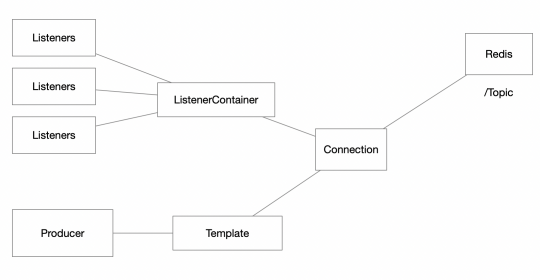

# REDIS Publish Subscribe

The idea of this tutorial is to use REDIS as a message broker that implements the publish-subscribe service. Specifically, we are going to implement the following architecture.
In this architecture, a producer sends multiple messages that are replicated to the 
listeners that are subscribed to the specified topic. To create the application, we will use the Spring enterprise application framework.



## Required Dependencies

```
<dependency>
 <groupId>org.springframework.boot</groupId>
 <artifactId>spring-boot-starter-data-redis</artifactId>
 <version>2.3.1.RELEASE</version>
 </dependency>
 <dependency>
 <groupId>javax.inject</groupId>
 <artifactId>javax.inject</artifactId>
 <version>1</version>
 <type>jar</type>
 </dependency>
```

